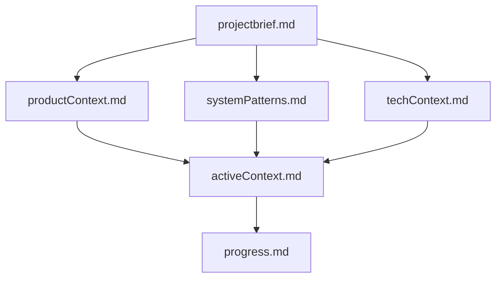
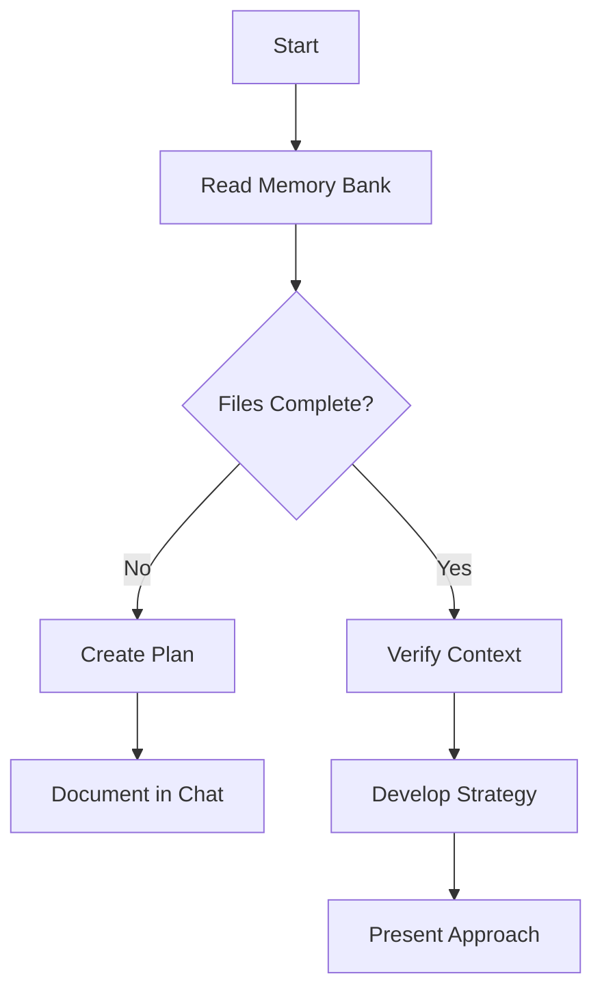
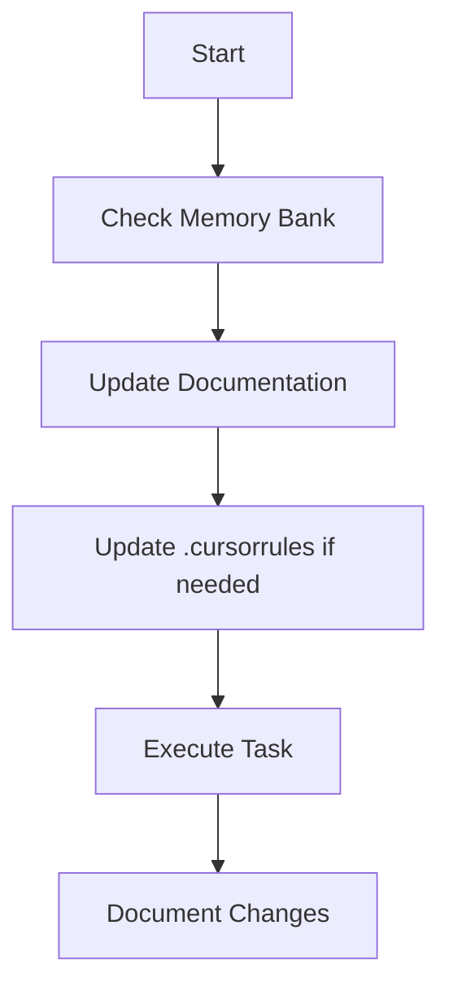
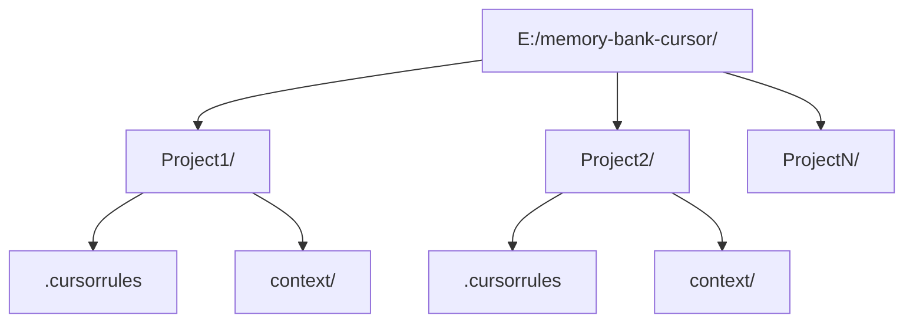

# Memory Bank - Comprehensive Guide

## Memory Bank Structure

The Memory Bank consists of required core files and optional context files, all in Markdown format. Files build upon each other in a clear hierarchy:



### Core Files (Required)
1. `projectbrief.md`
   - Foundation document that shapes all other files
   - Defines core requirements and goals
   - Source of truth for project scope

2. `productContext.md`
   - Why this project exists
   - Problems it solves
   - How it should work
   - User experience goals

3. `activeContext.md`
   - Current work focus
   - Recent changes
   - Next steps
   - Active decisions and considerations

4. `systemPatterns.md`
   - System architecture
   - Key technical decisions
   - Design patterns in use
   - Component relationships

5. `techContext.md`
   - Technologies used
   - Development setup
   - Technical constraints
   - Dependencies

6. `progress.md`
   - What works
   - What's left to build
   - Current status
   - Known issues

### Additional Context
Additional files/folders within memory-bank/ can be created when needed:
- Feature documentation
- API documentation
- Testing strategies
- Deployment procedures

## Core Workflows

### Plan Mode


### Act Mode


## Documentation Updates

Memory Bank updates occur when:
1. Discovering new project patterns
2. After implementing significant changes
3. When user requests with **update memory bank** (MUST review ALL files)
4. When context needs clarification

**Important**: When triggered by **update memory bank**, review EVERY memory bank file, even if some don't require updates. Focus particularly on activeContext.md and progress.md as they track current state.

## Project Intelligence (.cursorrules)

The .cursorrules file captures important patterns, preferences, and project intelligence that help work more effectively, including:
- Critical implementation paths
- User preferences and workflow
- Project-specific patterns
- Known challenges
- Evolution of project decisions
- Tool usage patterns

## Global Rules Storage System

All project-specific rules are stored in a centralized location on disk E in a folder called "memory-bank-cursor":



### Rule Management Process
1. Check if project folder exists in `E:/memory-bank-cursor/`
2. If not, create the folder structure for the project
3. Load the project's `.cursorrules` file at start of session
4. Update rules as new patterns emerge
5. Save updated rules back to the project's `.cursorrules` file

## Memory Bank MCP Tools

The Memory Bank MCP server provides the following tools for programmatic access:

1. **list_projects**
   - Lists all projects in the memory bank
   - Parameters: None

2. **create_project**
   - Creates a new project with standard file structure
   - Parameters: `project_name`

3. **list_project_files**
   - Lists all files in a specific project
   - Parameters: `project_name`

4. **get_file_content**
   - Retrieves content of a specific file
   - Parameters: `project_name`, `file_path`

5. **update_file_content**
   - Updates or creates a file with new content
   - Parameters: `project_name`, `file_path`, `content`

6. **init_memory_bank**
   - Initializes the memory bank structure if it doesn't exist
   - Parameters: None

### File Templates

When creating new files, use the following templates:

- **projectbrief.md**:
  ```markdown
  # Project Name
  
  ## Description
  Brief description of the project
  
  ## Goals
  - Goal 1
  - Goal 2
  
  ## Tasks
  - [ ] Task 1
  - [ ] Task 2
  ```

- **productContext.md**:
  ```markdown
  # Product Context
  
  ## Business Requirements
  - Requirement 1
  - Requirement 2
  
  ## User Stories
  1. As a user, I want to...
  2. As an administrator, I want to...
  ```

- **systemPatterns.md**:
  ```markdown
  # System Patterns
  
  ## Architectural Patterns
  - Pattern 1
  - Pattern 2
  
  ## Design Patterns
  - Pattern 1
  - Pattern 2
  ```

- **techContext.md**:
  ```markdown
  # Technical Context
  
  ## Technology Stack
  - Technology 1
  - Technology 2
  
  ## Dependencies
  - Dependency 1
  - Dependency 2
  ```

- **activeContext.md**:
  ```markdown
  # Active Context
  
  ## Current Tasks
  - [ ] Task 1
  - [ ] Task 2
  
  ## Open Questions
  - Question 1
  - Question 2
  ```

- **progress.md**:
  ```markdown
  # Project Progress
  
  ## Completed Tasks
  - [x] Task 1
  - [x] Task 2
  
  ## Plans
  - [ ] Plan 1
  - [ ] Plan 2
  ```

## Key Commands

1. "initialize memory bank"
   - Creates new project if needed
   - Establishes core files structure

2. "update memory bank"
   - Triggers full documentation review
   - Updates based on current state
   
3. "follow your custom instructions"
   - Follows Memory Bank Access Pattern
   - Executes appropriate Mode flow (Plan/Act)

REMEMBER: After every memory reset, I begin completely fresh. The Memory Bank is my only link to previous work. It must be maintained with precision and clarity, as my effectiveness depends entirely on its accuracy. 